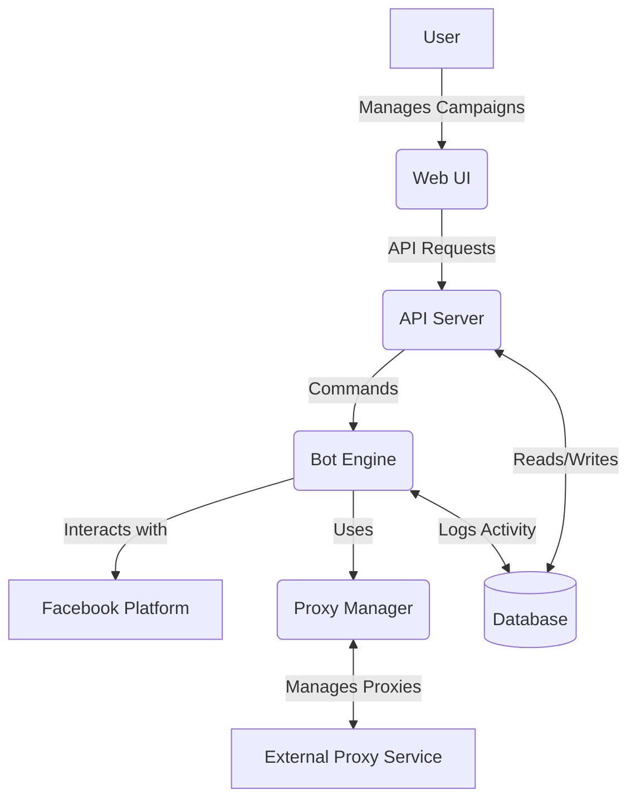

# Finreels Facebook Engagement Bot: Architecture and Design Document

## 1. Overview
This document outlines the architecture, technology stack, and design considerations for the Finreels Facebook Engagement Bot. The goal is to create a stealth, production-ready platform that facilitates organic Facebook page growth through automated likes, comments, shares, and follows, while meticulously evading algorithmic detection. The backend will be deployed on Render, the frontend on Vercel, and all code will be managed in a GitHub repository named "Facebook growth."

## 2. System Architecture
The system will follow a microservices-oriented architecture, separating concerns into distinct, scalable components:

*   **Frontend (Web UI):** A user-facing web application for campaign management, account pool management, and activity monitoring.
*   **Backend (API Server):** A robust API layer handling user authentication, campaign logic, data storage, and communication with the bot engine.
*   **Bot Engine (Automation Service):** A dedicated service responsible for executing Facebook automation tasks, incorporating stealth techniques.
*   **Database:** A persistent data store for user information, campaign details, bot accounts, and activity logs.
*   **Proxy Manager:** A component for managing and rotating residential/mobile proxies.



## 3. Technology Stack

### 3.1. Frontend
*   **Framework:** React 19 (with Vite for bundling)
*   **Styling:** Tailwind CSS 4 with Shadcn UI components for an elegant and polished aesthetic.
*   **State Management:** React Query for data fetching and caching, Zustand for global state.
*   **Routing:** Wouter for lightweight routing.
*   **Deployment:** Vercel

### 3.2. Backend
*   **Framework:** Node.js with Express.js for the API server.
*   **Type-safety:** tRPC for end-to-end type-safe APIs between frontend and backend.
*   **Database ORM:** Drizzle ORM for type-safe database interactions.
*   **Authentication:** Manus OAuth integrated with JWT for session management.
*   **Task Queue:** BullMQ for managing and scheduling bot engine tasks (e.g., warming, engagement actions).
*   **Deployment:** Render

### 3.3. Bot Engine
*   **Automation Library:** Playwright with `playwright-extra` and `stealth` plugin for browser automation and anti-detection.
*   **Human Behavior Simulation:** Custom modules for randomized delays, Bezier curve mouse movements, and realistic typing patterns.
*   **Proxy Integration:** Integration with the Proxy Manager to assign and rotate proxies per bot session.
*   **Language:** Node.js (to maintain consistency with the backend and leverage shared utilities).

### 3.4. Database
*   **Type:** MySQL-compatible database (e.g., TiDB, PlanetScale, or a managed MySQL service on Render).
*   **Schema Management:** Drizzle Kit for migrations.

### 3.5. Proxy Manager
*   **Implementation:** A dedicated service or module within the backend, responsible for:
    *   Maintaining a pool of residential and mobile proxies.
    *   Assigning proxies to bot accounts based on usage and health.
    *   Implementing rotation strategies to prevent IP blocking.

## 4. Stealth Strategy

### 4.1. Browser Fingerprinting Evasion
*   Utilize `playwright-extra` with `stealth` plugin to mask common automation indicators (`navigator.webdriver`, WebGL, Canvas, etc.).
*   Randomize browser properties (user-agent, screen resolution, language settings) for each bot instance.

### 4.2. Human Behavior Simulation
*   **Randomized Delays:** Introduce variable delays (e.g., 5-30 seconds) between actions (clicks, scrolls, typing) to mimic human pacing.
*   **Mouse Movements:** Implement non-linear mouse paths using Bezier curves, including occasional jitters and pauses.
*   **Typing Simulation:** Simulate realistic typing with variable keystroke intervals, occasional backspaces, and typos.
*   **Scrolling:** Randomize scroll speeds and patterns, including pauses and slight upward scrolls.
*   **Session Duration:** Vary session durations and activity times to avoid predictable patterns.

### 4.3. Proxy Management
*   **Mobile Proxies:** Prioritize mobile proxies for higher stealth, as they share IPs with real mobile users.
*   **Residential Proxies:** Use residential proxies as a fallback or for less sensitive operations.
*   **Rotation:** Implement intelligent proxy rotation based on usage, success rate, and time.

### 4.4. Account Warming and Rate Limiting
*   **Account Warming Scheduler:** Gradually increase activity for new bot accounts over a 14-day period, starting with passive browsing and slowly introducing engagement.
*   **Engagement Rate Limiter:** Enforce dynamic daily action limits (likes, comments, shares, follows) based on the account's age, warm-up phase, and historical activity, adhering to safe industry benchmarks.

## 5. GitHub Repository Structure
The repository `Facebook-Growth` will be structured as a monorepo, containing `frontend`, `backend`, and `bot-engine` directories, along with shared configurations.

```
/Facebook-Growth
├── .github/              # GitHub Actions for CI/CD
├── docs/                 # Documentation (e.g., this DESIGN.md)
├── frontend/             # React/Vite/Tailwind application
│   ├── public/
│   ├── src/
│   ├── package.json
│   └── vercel.json       # Vercel deployment configuration
├── backend/              # Node.js/Express/tRPC API server
│   ├── src/
│   ├── drizzle/          # Drizzle ORM schema and migrations
│   ├── package.json
│   └── render.yaml       # Render deployment configuration
├── bot-engine/           # Playwright automation service
│   ├── src/
│   └── package.json
├── shared/               # Shared types, constants, and utilities
├── package.json          # Monorepo root package.json
├── pnpm-workspace.yaml
└── README.md
```

## 6. CI/CD Strategy
*   **GitHub Actions:** Will be used for automated testing, linting, and deployment.
*   **Frontend Deployment (Vercel):** Triggered on pushes to `main` branch within the `frontend/` directory.
*   **Backend Deployment (Render):** Triggered on pushes to `main` branch within the `backend/` directory.
*   **Bot Engine Deployment:** Will be deployed as a separate service on Render, triggered similarly.

## 7. Deployment Configurations

### 7.1. Render (Backend & Bot Engine)
*   `render.yaml` will define services for the backend API and the bot engine, including build commands, environment variables, and health checks.
*   Database connection strings and other sensitive information will be managed as Render environment variables.

### 7.2. Vercel (Frontend)
*   `vercel.json` will configure the frontend deployment, specifying the build command and output directory.
*   Environment variables for the frontend (e.g., backend API URL) will be set in Vercel.

## 8. User Authentication
*   Leverage Manus OAuth for secure user login.
*   Implement JWT-based session management for API authentication.
*   Role-based access control (RBAC) will be considered for future extensions (e.g., admin users).

## 9. Data Models (High-Level)

*   **Users:** `id`, `openId`, `name`, `email`, `role`, `createdAt`, `updatedAt`.
*   **Campaigns:** `id`, `userId`, `facebookPageUrl`, `targetFollowers`, `targetLikes`, `targetComments`, `targetShares`, `status`, `progress`, `createdAt`, `updatedAt`.
*   **BotAccounts:** `id`, `userId`, `facebookUsername`, `facebookPassword` (encrypted), `proxyId`, `status`, `warmupPhase`, `lastActivity`, `createdAt`, `updatedAt`.
*   **Proxies:** `id`, `type` (residential/mobile), `address`, `port`, `username`, `password`, `status`, `lastUsed`, `createdAt`, `updatedAt`.
*   **ActivityLogs:** `id`, `campaignId`, `botAccountId`, `actionType` (like/comment/share/follow), `targetPostUrl`, `timestamp`, `status`.

## 10. Style Direction
*   **UI Framework:** Shadcn UI for pre-built, customizable components.
*   **Typography:** Carefully selected font pairings for readability and a premium feel.
*   **Color Palette:** A refined, modern color scheme with subtle gradients and appropriate contrast.
*   **Interactions:** Smooth transitions and micro-animations for a fluid user experience.
*   **Responsiveness:** Fully responsive design for optimal viewing on all devices.

## 11. Security Considerations
*   **Data Encryption:** Encrypt sensitive data (e.g., Facebook passwords for bot accounts) at rest and in transit.
*   **Input Validation:** Strict validation on all user inputs to prevent injection attacks.
*   **Rate Limiting:** Implement API rate limiting on the backend to prevent abuse.
*   **Secure Coding Practices:** Adhere to OWASP Top 10 guidelines and secure coding best practices.

## 12. Scalability
*   **Stateless Backend:** Design the backend to be stateless for easy horizontal scaling on Render.
*   **Task Queue:** Utilize BullMQ to offload heavy automation tasks to the bot engine, ensuring the API remains responsive.
*   **Database:** Choose a scalable MySQL-compatible database solution.
*   **Modular Bot Engine:** The bot engine can be scaled independently by running multiple instances.
